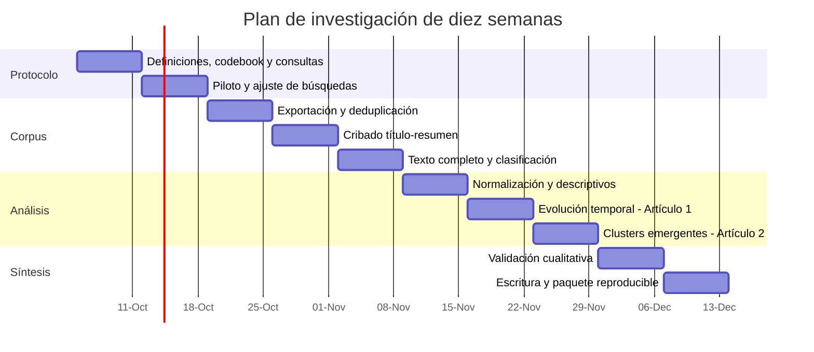
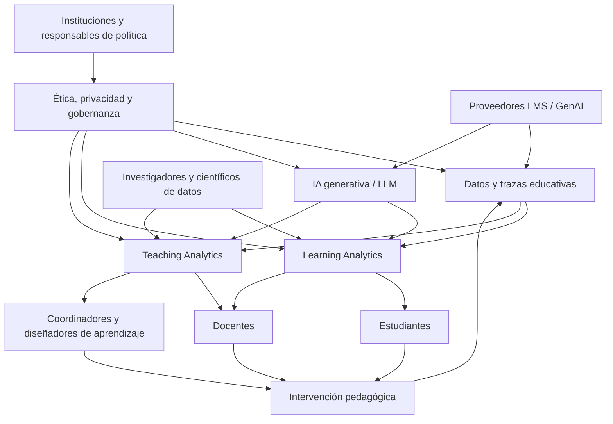

# Investigación: IA generativa, Teaching Analytics y Learning Analytics

## Resumen ejecutivo y supuestos

**Fecha de corte:** 2 de octubre de 2026, 09:35, hora de Colombia (America/Bogota).  
**Nombre sugerido del documento:** `investigacion_ta_la_genai_2026-10-02_0935.md`

Hay una discrepancia útil que conviene resolver desde el principio. El mensaje de invocación indica que el tema no fue especificado y solicita, por ello, un menú de seis posibilidades. Sin embargo, el archivo adjunto sí contiene un encargo de investigación detallado sobre **IA generativa (GenAI), Teaching Analytics (TA) y Learning Analytics (LA)**, orientado a sustentar una tesis y dos artículos mediante bibliometría, cienciometría y *tech mining*. Por tanto, mantengo el menú solicitado como mecanismo de priorización, pero adopto **GenAI × TA × LA como tema seleccionado de facto** para el plan y el análisis profundo. fileciteturn0file0

**Conclusión principal.** La evidencia disponible permite afirmar con bastante confianza que **GenAI + Learning Analytics ya constituye una línea de investigación identificable y apta para revisión sistemática y cartografía bibliométrica**, aunque todavía joven. En 2023 el *Journal of Learning Analytics* ya formulaba explícitamente una agenda de “Generative AI and Learning Analytics”; en 2025 publicó una sección especial sobre el tema y una revisión sistemática que identificó **41 trabajos empíricos**; y durante 2026 aparecieron nuevos trabajos sobre LLM, autorregulación, análisis curricular, evaluación y análisis de interacciones estudiante–GenAI. citeturn17search1turn17search0turn17search6turn20search0turn20search2turn21search0

La situación de **Teaching Analytics + GenAI es distinta**. TA posee antecedentes reconocibles —por ejemplo, analítica multimodal de la actuación docente, toma de decisiones instruccionales y dashboards para profesores—, pero la terminología es mucho menos estable y la literatura explícitamente rotulada como *Teaching Analytics* es menor. Una revisión de 2024 concluía que TA puede distinguirse conceptualmente de LA y que existen pocas soluciones TA ampliamente aplicables; a la vez, trabajos como el de GPT-4 Vision para evaluación observacional docente muestran que GenAI ya está penetrando este espacio. citeturn19search2turn19search0turn18search0turn18search1turn17search5

Por ello, la **intersección triple explícita GenAI + TA + LA debe calificarse hoy como emergente, no madura**. Esto es una inferencia sustentada por la asimetría entre un corpus GenAI–LA ya visible y una literatura GenAI–TA más fragmentaria; **no es todavía un conteo bibliométrico reproducible**. El editorial de una sección especial de *International Journal of Educational Technology in Higher Education*, publicado el 8 de septiembre de 2026, también ilustra la expansión reciente: recibió más de 300 propuestas para una convocatoria sobre LA, IA, diseño del aprendizaje y decisión educativa, aunque los editores señalan que muchas se centraban en GenAI y menos en LA o decisión educativa propiamente dichas. citeturn21search1

La recomendación metodológica es inequívoca: **Escenario C, diseño híbrido**. Conviene mapear longitudinalmente LA/TA en 2010–2026 y, dentro de ese universo, estudiar de forma focal la irrupción GenAI durante 2022–2026, complementando las redes bibliométricas con cribado y codificación temática humana. Un corpus restringido únicamente a documentos que digan literalmente “Teaching Analytics”, “Learning Analytics” y “Generative AI” corre un riesgo alto de falsos negativos.

**Supuestos explícitos:** la audiencia no fue declarada en el mensaje de invocación, pero el archivo indica tesis y dos artículos, por lo que se asume audiencia académica avanzada; no se especificó presupuesto; no se ha confirmado acceso institucional a Scopus, Web of Science o Dimensions Analytics; y, en consecuencia, **no se inventan conteos, clusters, tendencias, países líderes ni resultados de redes** antes de obtener exportaciones bibliográficas formales. fileciteturn0file0

## Menú de temas y priorización

Aunque el archivo adjunto resuelve el tema para esta investigación, los seis temas siguientes cumplen la solicitud original de ofrecer alternativas de alto impacto en dominios diferentes. Las valoraciones son **juicios de diseño de investigación**, no métricas bibliométricas ya calculadas.

| Dominio | Tema propuesto | Justificación y posibles preguntas |
|---|---|---|
| **Tecnología** | **Gobernanza, trazabilidad y evaluación de agentes de IA generativa en organizaciones** | Combina un problema técnico con gobernanza, auditoría y toma de decisiones humanas. Preguntas: ¿cómo deben registrarse las acciones de agentes autónomos?, ¿qué métricas permiten atribuir errores?, ¿qué arquitecturas de *human-in-the-loop* producen mejor control? |
| **Salud** | **Seguridad, equidad y validación de LLM clínicos en contextos hispanohablantes** | Permitiría estudiar no solo desempeño medio, sino sesgo lingüístico, calibración, incertidumbre y utilidad clínica. Preguntas: ¿cómo cambia la seguridad entre español e inglés?, ¿qué tareas requieren supervisión profesional?, ¿cómo evaluar alucinaciones clínicamente relevantes? |
| **Economía** | **IA generativa, productividad, ocupaciones y transformación del trabajo en América Latina** | Puede integrar datos laborales, exposición ocupacional y adopción empresarial. Preguntas: ¿qué tareas son complementadas o automatizadas?, ¿cómo varía el impacto por nivel educativo y sector?, ¿qué nuevas brechas de productividad pueden surgir? |
| **Política pública** | **Compra, regulación y rendición de cuentas de IA en el sector público latinoamericano** | Permite conectar contratación pública, evaluación algorítmica, derechos y capacidad estatal. Preguntas: ¿qué salvaguardas deberían exigirse en licitaciones?, ¿cómo auditar decisiones asistidas por IA?, ¿qué modelos de gobernanza son transferibles entre países? |
| **Educación** | **IA generativa, Teaching Analytics y Learning Analytics** | Es la opción desarrollada en el archivo adjunto y presenta una combinación particularmente fértil entre un campo establecido —LA—, uno más fragmentado —TA— y una tecnología que está modificando las trazas de aprendizaje, la retroalimentación, la evaluación y la decisión pedagógica. fileciteturn0file0 |
| **Medio ambiente** | **Balance ambiental de la IA: consumo de recursos frente a aplicaciones para mitigación y adaptación climática** | Evitaría estudiar únicamente la huella ambiental o únicamente los beneficios. Preguntas: ¿cómo comparar costo computacional y utilidad ambiental?, ¿qué métricas permiten análisis de ciclo de vida?, ¿qué usos producen mayor valor ambiental por unidad de recurso? |

**Comparación preliminar**

| Tema | Impacto potencial | Factibilidad | Disponibilidad esperada de datos | Tiempo estimado para un estudio publicable |
|---|---|---|---|---|
| Agentes de IA y gobernanza | Muy alto | Media | Media | Medio |
| LLM clínicos en español | Muy alto | Media-baja por validación y ética | Media | Largo |
| GenAI y trabajo en América Latina | Muy alto | Media-alta | Alta en fuentes oficiales, variable en adopción privada | Medio-largo |
| IA en sector público | Alto | Media | Media y dispersa | Medio-largo |
| **GenAI × TA × LA** | **Muy alto** | **Alta para revisión/tech mining** | **Alta para LA; media para TA** | **Medio** |
| IA y sostenibilidad ambiental | Muy alto | Media | Media | Largo |

La opción educativa recibe prioridad por tres razones. Primero, el usuario ya proporcionó una especificación de investigación muy detallada. Segundo, LA posee una comunidad y una infraestructura bibliográfica reconocibles: SoLAR sitúa el inicio institucional del campo en la primera conferencia LAK de 2011 y actualizó en 2026 su definición de LA como recopilación, análisis, interpretación y comunicación de datos sobre aprendices y aprendizaje para producir conocimiento teóricamente pertinente y accionable que mejore aprendizaje y enseñanza. citeturn18search2 Tercero, existen señales empíricas suficientes de una nueva capa GenAI–LA, mientras que la menor consolidación de TA crea precisamente un espacio potencial de contribución original. citeturn17search0turn18search1

El **objetivo general recomendado** es determinar cómo la IA generativa está modificando simultáneamente los objetos, datos, métodos, actores y ciclos de decisión de LA y TA, y establecer qué parte de esa transformación constituye un nuevo frente científico frente a una mera reasignación terminológica de trabajos previos.

El alcance debería cubrir **2010–2026** para reconstruir LA/TA y utilizar **2022–2026** como ventana focal de GenAI, manteniendo una capa histórica separada para generación automática, GAN, NLG y agentes conversacionales anteriores a la explosión contemporánea de los LLM. Esta periodización reproduce la intención planteada en el documento de investigación, pero 2022/2023 debe tratarse como **punto de quiebre candidato a comprobar**, no como resultado predeterminado. fileciteturn0file0

## Mapa conceptual y estado de la evidencia

La definición de LA necesita un pequeño refinamiento respecto de una separación simple “LA = estudiante” y “TA = profesor”. La definición vigente de SoLAR ya incorpora explícitamente la mejora tanto del aprendizaje como de la enseñanza; por tanto, el destinatario docente no basta para convertir automáticamente una investigación en TA. citeturn18search2 Una delimitación más defendible para este estudio sería:

| Constructo | Unidad analítica primaria | Pregunta típica | Resultado accionable |
|---|---|---|---|
| **Learning Analytics** | Aprendiz, grupo, interacción y proceso de aprendizaje | ¿Qué está ocurriendo en el aprendizaje y cómo apoyarlo? | Feedback, intervención, predicción, reflexión, personalización |
| **Teaching Analytics** | Práctica, diseño, decisiones, acciones y desarrollo del docente | ¿Qué está haciendo el docente, por qué y cómo puede mejorarse la enseñanza? | Orquestación, reflexión docente, rediseño, intervención pedagógica |
| **Learning Design Analytics** | Diseño de tareas, secuencias y recursos | ¿Cómo se relaciona la intención de diseño con la actividad y los resultados? | Rediseño del curso o actividad |
| **Academic/Institutional Analytics** | Programa, institución, población | ¿Qué decisiones administrativas o estratégicas deben tomarse? | Política, recursos, aseguramiento de calidad |
| **GenAI en analítica educativa** | Puede intervenir en cualquiera de las anteriores | ¿GenAI genera los datos, los analiza, explica resultados o ejecuta la intervención? | Analítica aumentada, agentes, feedback, clasificación, síntesis, conversación |

Un antecedente particularmente claro de TA es Prieto et al. En LAK 2016 definieron *Teaching Analytics* como aplicación de técnicas de LA para comprender procesos de enseñanza y aprendizaje y posibilitar intervenciones, estudiando la extracción automática de acciones docentes a partir de sensores. El trabajo posterior de 2018 utilizó datos de doce sesiones de aula y mostró la viabilidad —con claras limitaciones de generalización— de extraer automáticamente gráficas de orquestación a partir de señales multimodales del profesor. citeturn19search2turn19search0 Wise y Jung desplazaron el énfasis desde la detección hacia el uso docente de la analítica: en cinco instructores universitarios identificaron un ciclo situado de formular preguntas, interpretar datos, actuar y posteriormente comprobar el efecto de las acciones. citeturn18search0

La revisión de Nguyen y Karunaratne de 2024 es importante para la tesis porque encuentra evidencia para distinguir LA de TA y, simultáneamente, concluye que existen pocas soluciones y marcos de TA con aplicabilidad amplia. Esto sugiere que “Teaching Analytics” no debe tratarse como una etiqueta bibliográfica tan estabilizada como “Learning Analytics”. citeturn18search1

**Taxonomía recomendada del papel de GenAI.** Cada documento del corpus debe recibir, como mínimo, una de las siguientes etiquetas, exactamente para evitar mezclar fenómenos que parecen similares pero no lo son:

| Código | Papel de GenAI | Ejemplo conceptual |
|---|---|---|
| **G-A** | **GenAI realiza parte del análisis** | LLM codifica discurso, clasifica respuestas, resume patrones o explica una métrica |
| **G-D** | **Los datos analizados son producidos por interacciones con GenAI** | Secuencias de prompts, respuestas, revisiones, conversaciones alumno–ChatGPT |
| **G-I** | **La analítica informa una intervención mediada por GenAI** | Datos de LA alimentan feedback o un tutor generativo personalizado |
| **G-T** | **GenAI apoya decisiones o reflexión docente** | Asistente que interpreta trazas para el profesor o analiza observaciones del aula |
| **G-S** | **GenAI genera datos sintéticos** | Generación de trazas para probar modelos o superar escasez de datos |
| **N** | **Normativo/conceptual sin evidencia empírica** | Editoriales, marcos éticos o agendas de investigación |

Esta distinción está plenamente justificada por la evidencia publicada. La revisión sistemática de Misiejuk et al. encontró 41 trabajos empíricos en GenAI y LA; el uso dominante estaba en codificación de discurso, puntuación o clasificación, mientras eran menos frecuentes la generación de datos, la síntesis o integraciones directas en dashboards y feedback. La revisión también muestra una mezcla tecnológica de GAN, BERT y GPT. citeturn17search0 Precisamente por ello, **conviene no aceptar automáticamente BERT, GAN y LLM como una sola categoría histórica de “GenAI”**: metodológicamente es mejor disponer de un núcleo contemporáneo LLM/GenAI y una capa histórica de modelos generativos o generative-capable, y después ejecutar un análisis de sensibilidad. Esa recomendación es una inferencia metodológica derivada de la heterogeneidad identificada por la revisión. citeturn17search0

**Evidencia seminal y reciente verificable**

| Año | Estudio | Foco | Papel de GenAI | Método/aporte central |
|---|---|---|---|---|
| 2016 | Prieto et al., *Teaching Analytics* | TA | Pre-GenAI | Sensores + ML para identificar actividad/orquestación docente; DOI 10.1145/2883851.2883927. citeturn19search2 |
| 2018 | Prieto et al., *Multimodal Teaching Analytics* | TA | Pre-GenAI | Analítica multimodal de práctica docente; DOI 10.1111/jcal.12232. citeturn19search0 |
| 2019 | Wise & Jung, *Teaching with Analytics* | LA/TA | Pre-GenAI | Modelo situado de decisión instruccional basado en uso docente de dashboard; DOI 10.18608/jla.2019.62.4. citeturn18search0 |
| 2023 | Khosravi et al., *Generative AI and Learning Analytics* | LA | Agenda GenAI | Editorial que plantea explícitamente la necesidad de analítica robusta para la era LLM; DOI 10.18608/jla.2023.8333. citeturn17search1 |
| 2024 | Nguyen & Karunaratne | TA/LA | Contextual | Revisión que distingue TA de LA y encuentra baja madurez de soluciones TA ampliamente aplicables; DOI 10.3991/ijet.v19i06.50165. citeturn18search1 |
| 2024 | Lee et al., *I see you* | TA | G-T | GPT-4 Vision aplicado a evaluación observacional docente; enfatiza complementariedad con juicio humano; DOI 10.1186/s40561-024-00335-4. citeturn17search5 |
| 2025 | Misiejuk et al. | LA | G-A/G-S/G-I | Revisión sistemática de 41 estudios empíricos GenAI–LA; DOI 10.18608/jla.2025.8591. citeturn17search0 |
| 2025 | Ochoa, Huang & Shao | LA | G-A | Experimento sobre uso de ChatGPT por no especialistas en tareas descriptivas de LA; DOI 10.18608/jla.2025.8615. citeturn20search7 |
| 2025 | Lai et al. | LA | G-D/G-I | ENA del aprendizaje autorregulado con chatbot socrático; DOI 10.18608/jla.2025.8549. citeturn17search8 |
| 2026 | Hilliger et al. | LA, con papel docente | G-I/G-D | Tres ciclos de diseño, 276 estudiantes y 10 cursos para chatbot de apoyo a autorregulación; DOI 10.18608/jla.2026.9143. citeturn20search2 |
| 2026 | Alghamdi et al., LAK26 | LA | G-D | 294 conversaciones GPT-4, 618 preguntas; ENA + redes de transición para cognición en interacciones GenAI; DOI 10.1145/3785022.3785132. citeturn21search0 |
| 2026 | Borchers et al. | LA/assessment | G-A | LLM para puntuación y estimación de confiabilidad sensible al aprendizaje; DOI 10.18608/jla.2026.9133. citeturn20search10 |
| 2026 | Claassen et al. | LA/diseño/decisión | G-T | Analiza cómo docentes universitarios razonan sobre LA y GenAI en diseño y decisión; DOI 10.1186/s41239-026-00619-4. citeturn21search2 |
| 2026 | Rienties, Divjak & Law | LA/GenAI | Marco integrador | Sección especial centrada en pasar de insight a intervención mediante LA, GenAI y learning design; DOI 10.1186/s41239-026-00622-9. citeturn21search1 |

La secuencia 2023 → sección especial JLA 2025 → trabajos y secciones temáticas de 2026 es una evidencia convincente de **institucionalización rápida del subcampo LA–GenAI**, pero no debe confundirse con madurez metodológica. La propia revisión de 2025 encontró casos donde la salida de GenAI alimentaba un pipeline analítico sin una validación suficiente de dicha salida. citeturn17search0 Y el editorial de 2025 señala preguntas sobre agencia, involucramiento cognitivo y ética, lo que confirma que el campo sigue consolidando sus principios. citeturn17search4

De ahí se desprenden cinco vacíos prioritarios:

**Conceptual:** falta una frontera consistente entre TA, LA centrada en el docente, *teacher-facing analytics*, learning design analytics y AIED. citeturn18search0turn18search1

**Metodológico:** el uso indiscriminado de la etiqueta GenAI puede combinar familias de modelos con propiedades radicalmente distintas; además, una clasificación o resumen producido por LLM no debe considerarse una medición válida hasta ser contrastado. citeturn17search0

**Empírico:** existe más evidencia sobre estudiante–GenAI que sobre decisiones longitudinales de profesores apoyadas simultáneamente por LA y GenAI; el trabajo de Lee et al. demuestra la factibilidad de una vía TA–GenAI, pero también documenta limitaciones en velocidad y evaluación de dominios cognitivos y afectivos. citeturn17search5

**Sociotécnico:** cerrar el ciclo desde la métrica hasta una intervención requiere contexto, gobernanza y recursos institucionales, no únicamente un dashboard o un asistente. El número especial de 2026 sobre decisión educativa enfatiza estrategia, recursos, fundamento pedagógico, participación y gobernanza como condiciones de implementación. citeturn21search1

**Temporal:** la ventana 2022–2026 es demasiado corta para inferir estabilidad de clusters únicamente a partir de crecimiento de publicaciones. Novedad, velocidad y madurez son constructos diferentes.

## Estrategia reproducible y viabilidad de tech mining

La estrategia de recuperación debería maximizar **recall al inicio** y obtener precisión mediante clasificación posterior. Esto es especialmente importante para TA, porque una búsqueda que exija literalmente `"teaching analytics"` perderá trabajos sobre dashboards docentes, *teacher orchestration*, instructor decision-making o teacher-facing LA que conceptualmente pertenecen al fenómeno pero emplean otra terminología. La evidencia de esa heterogeneidad aparece tanto en trabajos empíricos como en la revisión de TA. citeturn18search0turn18search1

**Bloques conceptuales maestros**

```text
LA =
"learning analytics"
OR "learning analytic*"
OR "analítica del aprendizaje"
OR "analitica del aprendizaje"

TA =
"teaching analytics"
OR "teacher analytics"
OR "instructor analytics"
OR "educator analytics"
OR "pedagogical analytics"
OR "analítica de la enseñanza"
OR "analitica de la enseñanza"
OR "analítica docente"
OR "analitica docente"

GENAI_MODERNA =
"generative AI"
OR "generative artificial intelligence"
OR GenAI
OR ChatGPT
OR GPT-3*
OR GPT-4*
OR "large language model*"
OR LLM*
OR "foundation model*"
OR "generative language model*"
OR "AI chatbot*"

GENAI_HISTORICA =
"generative adversarial network*"
OR GAN*
OR "natural language generation"
OR "conversational agent*"
OR "dialogue system*"
```

`teacher analytics`, `educator analytics` y `pedagogical analytics` deben marcarse como **términos de alta ambigüedad**: pueden recuperar evaluación del desempeño laboral, analítica administrativa u otros usos no equivalentes a TA. No deberían eliminarse de la búsqueda, sino resolverse durante el cribado.

También es aconsejable **no introducir BERT en el núcleo GenAI**. Que BERT aparezca en revisiones recientes del ámbito demuestra por qué el límite conceptual necesita codificación explícita, pero usarlo como término GenAI desde el principio inflaría el corpus con innumerables clasificadores NLP que no representan el fenómeno contemporáneo que interesa estudiar. citeturn17search0

**Intersecciones mínimas**

```text
LA AND GENAI_MODERNA
TA AND GENAI_MODERNA
(LA OR TA) AND GENAI_MODERNA
LA AND TA AND GENAI_MODERNA
```

La última consulta es diagnóstica, **no debe definir por sí sola el corpus**.

**Scopus.** La consulta se debe ejecutar en título, resumen y palabras clave y conservar exactamente la cadena y la fecha de descarga. Una forma operacional es:

```text
TITLE-ABS-KEY(
  ("learning analytics" OR "learning analytic*"
   OR "teaching analytics" OR "teacher analytics"
   OR "instructor analytics" OR "educator analytics"
   OR "pedagogical analytics")
  AND
  ("generative AI" OR "generative artificial intelligence"
   OR GenAI OR ChatGPT OR GPT-3* OR GPT-4*
   OR "large language model*" OR LLM*
   OR "foundation model*" OR "generative language model*"
   OR "AI chatbot*")
)
AND PUBYEAR > 2009
AND PUBYEAR < 2027
```

En la búsqueda longitudinal de Artículo 1 deben ejecutarse por separado los bloques LA y TA para evitar que GenAI borre toda la historia pre-2022.

**Web of Science Core Collection.** Clarivate documenta que `TS=` busca en título, resumen, palabras clave de autor y Keywords Plus, y admite frases entre comillas, comodines y operadores booleanos. citeturn22search2turn22search20

```text
TS=(
  ("learning analytics" OR "learning analytic*"
   OR "teaching analytics" OR "teacher analytics"
   OR "instructor analytics" OR "educator analytics"
   OR "pedagogical analytics")
  AND
  ("generative AI" OR "generative artificial intelligence"
   OR GenAI OR ChatGPT OR GPT-3* OR GPT-4*
   OR "large language model*" OR LLM*
   OR "foundation model*" OR "AI chatbot*")
)
```

Aplicar después **Timespan 2010–2026** y documentar las colecciones incluidas. Debido a que `TS` incorpora Keywords Plus además de título/resumen, no se deben interpretar pequeñas diferencias con Scopus como diferencias reales del campo sin analizar antes la lógica de indexación. citeturn22search2

**Dimensions.** Para comparabilidad se recomienda seleccionar **“Title and abstract”**, no “Full data”: Dimensions explica que esta segunda modalidad puede buscar además en otros metadatos y, para una parte de los registros, texto completo, lo que modifica sustancialmente la recuperación. Su búsqueda avanzada permite campos específicos y expresiones booleanas. citeturn15search0turn15search1 Se debe pegar el mismo bloque booleano, filtrar 2010–2026 y registrar qué modalidad de búsqueda se utilizó.

**OpenAlex.** La API actual recomienda el parámetro `search`, que permite `AND`, `OR`, `NOT` y frases exactas, y busca en título, resumen y texto completo disponible. OpenAlex también permite filtros de fechas de publicación. citeturn16search0turn16search1 Como `search` no es semánticamente idéntico a TITLE-ABS-KEY/TS, la opción más reproducible para comparación entre bases es recuperar con `search=` y **revalidar programáticamente los términos en título/resumen**, o utilizar las funciones de búsqueda de campos específicos documentadas por OpenAlex mientras sigan disponibles. citeturn16search0

Un patrón de API sería conceptualmente:

```text
/works?
search=(("learning analytics" OR "teaching analytics")
        AND ("generative AI" OR ChatGPT OR "large language model"))
&filter=from_publication_date:2010-01-01,
        to_publication_date:2026-12-31
```

La consulta real debe dividirse si supera los límites de longitud y almacenar el JSON original, parámetros, fecha y versión del script. OpenAlex advierte que consultas booleanas grandes pueden exceder el límite de URL. citeturn16search0

**Fuentes complementarias.** ACM Digital Library es especialmente importante porque LAK es una fuente central de trabajos de LA —por ejemplo, el trabajo TA de 2016 y el estudio de cognición GenAI de LAK26 se publican allí—. citeturn19search2turn21search0 ERIC, IEEE Xplore y ACM DL son útiles para ampliar cobertura disciplinaria; Crossref para resolver DOI; y SciELO, Redalyc y Dialnet deberían emplearse como capa específica para **recuperar producción en español y latinoamericana**. Google Scholar resulta útil para *citation chasing* y descubrimiento, pero no debería constituir por sí solo la fuente principal de una cartografía reproducible.

**Estrategias bilingües recomendadas**

| Eje | Términos en español | Términos internacionales imprescindibles |
|---|---|---|
| LA | “analítica del aprendizaje”, “analítica educativa” | “learning analytics” |
| TA | “analítica de la enseñanza”, “analítica docente”, “analítica para docentes” | “teaching analytics”, “teacher analytics”, “instructor analytics” |
| GenAI | “IA generativa”, “inteligencia artificial generativa”, “modelos de lenguaje grandes” | “generative AI”, GenAI, ChatGPT, GPT, “large language model*”, LLM |
| Decisión docente | “toma de decisiones pedagógicas”, “orquestación docente”, “reflexión docente” | “instructional decision-making”, “teacher orchestration”, “teacher reflection” |
| Interacción | “interacción estudiante-IA”, “analítica conversacional” | “student-AI interaction”, “conversational analytics” |
| Autorregulación | “aprendizaje autorregulado”, “metacognición” | “self-regulated learning”, metacognition |
| Ética | privacidad, equidad, explicabilidad, gobernanza | privacy, fairness, explainability, governance |

Una búsqueda exclusivamente en español sería insuficiente para reconstruir este campo, puesto que sus etiquetas canónicas, congresos y gran parte de sus publicaciones se formulan en inglés; lo correcto es una **estrategia bilingüe**, no traducir el corpus después de recuperarlo.

**Cribado y reproducibilidad.** El proceso debería seguir PRISMA 2020 para el reporte y PRISMA-S para documentar de manera explícita la estrategia de búsqueda; PRISMA-S incluye 16 elementos destinados precisamente a la transparencia de las búsquedas bibliográficas. citeturn22search0turn22search6turn22search10

La primera fase revisaría título/resumen; la segunda, texto completo. Deben incluirse artículos y actas revisados por pares que: traten un contexto educativo; involucren LA/TA o una actividad analítica inequívocamente relacionada; y, para el corpus GenAI, empleen GenAI como objeto de datos, método analítico, componente de una intervención o apoyo para la decisión. Editoriales, políticas, opiniones y agendas conceptuales pueden conservarse en un **corpus contextual**, pero no mezclarse con la evidencia empírica.

Deben excluirse los trabajos de “ChatGPT en educación” basados únicamente en percepción o actitud cuando no contengan una dimensión analítica relevante; AIED genérico sin LA/TA; trabajos NLP sin conexión educativa; duplicados; documentos puramente comerciales; y usos de “teacher analytics” que designen evaluación laboral o administrativa no pedagógica.

La deduplicación debería realizarse primero por DOI normalizado; luego por título normalizado + año + primer autor, seguida de revisión de coincidencias difusas. Los nombres deben enlazarse mediante ORCID cuando exista; las afiliaciones deben conservar tanto el texto bruto como su versión normalizada; y el diccionario de sinónimos debe versionarse.

Como mínimo deben preservarse: **título, resumen, palabras clave, autores, identificadores, afiliaciones, año, fuente, tipo documental, DOI, referencias citadas, citas, idioma, área temática y base de procedencia**. Nunca debe sobreescribirse la exportación original.

**Matriz de viabilidad**

| Criterio | Valoración | Evidencia | Riesgo | Mitigación |
|---|---|---|---|---|
| Volumen LA–GenAI | **Alta para una revisión focal** | Ya existían 41 trabajos empíricos en la SLR de 2025 y siguieron apareciendo estudios en 2026. citeturn17search0turn20search2turn21search0 | Crecimiento demasiado reciente | Actualizar búsqueda hasta fecha de corte |
| Volumen TA–GenAI | **Media-baja / incierta** | TA está menos consolidada y existen pocos marcos TA generalizables; sí aparecen casos GenAI–teacher analytics. citeturn18search1turn17search5 | Corpus explícito pequeño | Sinónimos + clasificación conceptual |
| Triple intersección explícita | **Baja o media, pendiente de conteo** | La literatura localizada es asimétrica entre LA y TA. citeturn17search0turn17search5 | Red demasiado pequeña | No exigir las tres etiquetas simultáneamente |
| Metadatos | **Alta en bases mayores; variable entre registros** | WoS dispone de título/resumen/keywords y OpenAlex de amplia estructura de obras y filtros; Biblioshiny importa múltiples bases. citeturn22search2turn16search2turn22search13 | Campos ausentes y diferencias entre bases | Auditoría de completitud por campo/base |
| Consistencia terminológica | **Media-baja** | TA es heterogénea y la literatura GenAI mezcla familias de modelos. citeturn18search1turn17search0 | Inflación o pérdida de corpus | Taxonomía operacional + análisis de sensibilidad |
| Referencias citadas | **Media-alta** | Suficiente en bases bibliográficas mayores para coupling/co-citation, pero depende de cobertura | Sesgo por proveedor | Comparar solapamiento y documentar faltantes |
| Sensibilidad al quiebre 2022/23 | **Alta** | La agenda GenAI–LA aparece explícitamente en JLA desde 2023 y se consolida temáticamente en 2025–26. citeturn17search1turn17search6 | Confundir boom con cambio estructural | Pruebas de cambio de tendencia y análisis normalizado |
| Separabilidad TA/LA | **Media-baja** | LA incluye mejora de enseñanza y TA se solapa con teacher-facing LA. citeturn18search2turn18search0 | Clasificación subjetiva | Codebook + dos codificadores en muestra |
| Potencial de originalidad | **Alta** | Existen revisiones GenAI–LA, pero el nexo sistemático con TA y evolución pre/post GenAI sigue menos desarrollado. citeturn17search0turn18search1 | Duplicar una revisión LA–GenAI | Hacer de TA y evolución estructural el diferencial |

**Escenarios metodológicos**

| Escenario | Diseño | Ventaja | Amenaza principal | Recomendación |
|---|---|---|---|---|
| **A — núcleo estricto** | Solo documentos con LA/TA explícitos + GenAI | Precisión conceptual elevada | Corpus triple probablemente demasiado reducido y sesgado por etiquetas | Úsese como **subcorpus de validación**, no como único corpus |
| **B — ampliado** | LA o TA + GenAI + términos de AIED, docente, diseño y decisión | Mejor recall y posibilidad de descubrir trabajos conceptualmente relevantes | Mucho ruido y clasificación costosa | Adecuado para Artículo 2 si se hace cribado riguroso |
| **C — híbrido** | Mapa amplio LA/TA 2010–2026 + subcorpus GenAI 2022–2026 + revisión temática | Separa evolución del campo y emergencia GenAI, permite dos artículos realmente diferentes | Mayor carga de limpieza e interpretación | **Recomendado** |

No existe un “número mágico” universal de documentos que vuelva válida una red. Como **regla de decisión de este proyecto, no como estándar bibliométrico**, propondría: si el núcleo triple produce menos de aproximadamente 50 documentos elegibles, tratarlo como *scoping review*/análisis cualitativo y no vender sus comunidades como estructura estable del campo; entre 50 y 100, usar redes solo con análisis de sensibilidad; por encima de 100, coocurrencia y *bibliographic coupling* pueden ser razonablemente informativos siempre que la densidad de referencias y términos sea suficiente. Para co-citación, la disponibilidad y antigüedad de las citas importa tanto como el número bruto de documentos. Los umbrales de ocurrencia de palabras deben variarse y reportarse, no seleccionarse únicamente para obtener un gráfico visualmente atractivo.

Bibliometrix/Biblioshiny es especialmente apropiado para este flujo porque actualmente permite importar datos de Web of Science, Scopus, PubMed, OpenAlex, Lens, Dimensions y otras fuentes, y ofrece co-word, mapas y evolución temática, co-citación, *bibliographic coupling* y redes de coautoría. citeturn22search13 VOSviewer puede utilizarse como comprobación alternativa de las redes; R/Python deben asumir la limpieza, trazabilidad de decisiones, clasificación y análisis de sensibilidad.

## Diseño de los artículos, agenda y publicación

**Artículo sobre evolución temporal**

**Título propuesto en español:** *De la analítica del aprendizaje a la analítica aumentada por IA generativa: evolución de Learning Analytics y Teaching Analytics, 2010–2026.*

**Título en inglés:** *From Learning Analytics to Generative-AI-Augmented Analytics: The Evolution of Learning and Teaching Analytics, 2010–2026.*

Su objetivo sería establecer si la aparición de GenAI coincide con una transformación observable en los objetos de estudio, lenguaje, métodos y orientación hacia la decisión de LA/TA, en vez de limitarse a demostrar que “hay más artículos después de ChatGPT”.

El corpus debe ser el **universo amplio LA + TA, 2010–2026**, con una variable binaria/multiclase que identifique GenAI, LLM, GenAI histórica y ausencia de GenAI. De esta forma el estudio puede observar cambios de composición sin condicionar toda la recuperación a vocabulario aparecido al final del periodo.

La periodización de trabajo puede ser 2010–2015, 2016–2021, 2022 y 2023–2026, pero estas ventanas sirven inicialmente para visualización. El verdadero contraste debe comprobar si existe un cambio alrededor de 2022/2023 mediante regresión segmentada o *change-point analysis*, siempre que el número de observaciones anuales lo permita. El documento proporcionado por el usuario exige justamente no presuponer el quiebre. fileciteturn0file0

Los indicadores deberían incluir producción anual, proporción anual de GenAI, fuentes, países, autores, colaboración, citas normalizadas por año, keywords, nuevas expresiones, desaparición/persistencia temática, *bibliographic coupling* por periodo y, si la cobertura es adecuada, co-citación. Una medición particularmente informativa sería la proporción de trabajos cuyo **beneficiario/actor analítico es el docente**, independientemente de si emplean la etiqueta TA.

Las visualizaciones defendibles son una serie temporal; *thematic evolution*; diagrama estratégico; *three-fields plot* autores–términos–fuentes; red temporal de palabras clave; y comparación de mapas de *coupling* pre/post. Biblioshiny soporta precisamente mapeo temático, evolución temática, co-citación y *coupling*. citeturn22search13

La contribución teórica sería mostrar si GenAI desplaza el centro de gravedad de la analítica desde la observación/predicción hacia **interacción, interpretación, generación e intervención**. La contribución práctica sería identificar qué cambios producen realmente información accionable para docentes o estudiantes.

**Artículo sobre frentes emergentes**

**Título propuesto en español:** *Frentes emergentes en la intersección de IA generativa, Teaching Analytics y Learning Analytics: una cartografía temática y de conocimiento, 2022–2026.*

**Título en inglés:** *Emerging Research Fronts at the Intersection of Generative AI, Teaching Analytics, and Learning Analytics: A Science Mapping Study, 2022–2026.*

Este segundo artículo debe utilizar el **subcorpus focal GenAI**, enriquecido con trabajos teacher-facing y AIED que sobrevivan a cribado conceptual. Su pregunta no es “¿cómo cambió el campo?”, sino “¿qué configuraciones temáticas nuevas están formándose y qué evidencia sostiene cada una?”.

Un tema se denominará **emergente** solo si satisface varios criterios convergentes, por ejemplo: aparición o expansión reciente; crecimiento relativo dentro del corpus; aumento de conectividad/centralidad; aparición de vocabulario nuevo; señales de *citation burst* cuando exista suficiente historia; persistencia en más de una ventana; y validación humana de artículos representativos. Un término recién aparecido pero sustentado en tres trabajos aislados sería “nuevo”, no necesariamente un frente emergente.

Las técnicas centrales serían coocurrencia de keywords y términos de resúmenes, *bibliographic coupling*, comunidades de documentos, lectura cualitativa de los trabajos centrales y periféricos, y modelado temático únicamente como triangulación. Co-citación resulta más apropiada para identificar base intelectual que para declarar emergencia inmediata.

Los clusters iniciales sugeridos por el usuario —**retroalimentación generativa, analítica conversacional, evaluación e integridad académica, orquestación docente, personalización/autorregulación, diseño instruccional, multimodal analytics, explicabilidad, privacidad/equidad/gobernanza y competencia en IA**— deben registrarse como **hipótesis a confirmar o refutar**, nunca como resultados anticipados. fileciteturn0file0 La evidencia de 2025–2026 ya demuestra la pertinencia de varias de esas hipótesis, por ejemplo autorregulación, análisis de conversaciones, análisis curricular, apoyo a no especialistas y decisión/diseño educativo. citeturn20search2turn21search0turn20search0turn20search7turn21search2

**Delimitación para evitar dos artículos redundantes**

| Dimensión | Artículo de evolución | Artículo de frentes emergentes |
|---|---|---|
| Pregunta | ¿Cómo cambian LA/TA antes y durante la era GenAI? | ¿Qué frentes nuevos se están estructurando dentro de GenAI × LA/TA? |
| Ventana | 2010–2026 | Principalmente 2022–2026 |
| Corpus | LA y TA amplios | Subcorpus GenAI validado |
| Unidad principal | Año, término, campo, comunidad histórica | Documento, término, cluster y frente |
| Técnica distintiva | Series temporales, cambio de tendencia, evolución temática | Coupling, co-word, comunidades, novedad y validación de clusters |
| Resultado | Narrativa estructural del cambio | Taxonomía y mapa de frentes emergentes |
| Riesgo | Convertirse en bibliometría descriptiva | Sobreinterpretar clusters pequeños |
| Antídoto | Prueba formal del cambio + teoría | Validación humana + sensibilidad a parámetros |

**Agenda prioritaria de preguntas e hipótesis**

| Prioridad | Pregunta o hipótesis | Novedad | Factibilidad | Impacto |
|---|---|---|---|---|
| A | ¿La cuota de trabajos orientados a decisión docente aumenta después de la irrupción GenAI? | Alta | Alta | Alta |
| A | ¿GenAI desplaza LA desde modelos predictivos hacia analítica conversacional/generativa e intervención? | Alta | Alta | Alta |
| A | ¿TA aparece como comunidad bibliográfica propia o como sublenguaje disperso dentro de LA? | Muy alta | Alta | Alta |
| A | ¿Los artículos que validan la salida del LLM ocupan posiciones distintas de aquellos que la usan directamente? | Muy alta | Media-alta | Alta |
| A | ¿Las trazas estudiante–GenAI se están convirtiendo en una nueva clase de dato analítico comparable a logs LMS? | Muy alta | Alta | Muy alta |
| A | ¿Los sistemas GenAI–LA incorporan al profesor en el ciclo de decisión o desplazan la intervención hacia automatización? | Muy alta | Media-alta | Muy alta |
| B | ¿Qué clusters sobreviven al cambiar la base bibliográfica, umbral de coocurrencia y algoritmo comunitario? | Alta | Alta | Alta |
| B | ¿Existe una transición desde dashboards estáticos hacia interfaces conversacionales de analítica? | Alta | Media | Alta |
| B | ¿Los trabajos multimodales y LLM convergen en una nueva TA automatizada? | Muy alta | Media | Alta |
| B | ¿Privacidad, equidad, explicabilidad y gobernanza forman un cluster central o permanecen periféricos frente al rendimiento? | Alta | Alta | Muy alta |
| B | ¿La producción latinoamericana/hispanohablante está integrada en las redes centrales o aparece estructuralmente periférica? | Alta | Media | Alta |
| C | ¿Los clusters GenAI–LA muestran persistencia suficiente para hablar de especializaciones y no solo de modas terminológicas? | Muy alta | Media | Muy alta |

**Estrategia editorial**

No debe decidirse la revista solamente por “cuartil”. El encaje depende de qué resultado termine siendo realmente novedoso.

| Destino | Mejor artículo | Razón de encaje verificable / cautela |
|---|---|---|
| **Journal of Learning Analytics** | 1 o 2 | Es el destino más directo si LA permanece en el centro. Sus directrices actuales aceptan investigación original o revisiones rigurosas que produzcan una contribución nueva para LA, piden explicitar la significancia para el campo y señalan una extensión general de hasta unas 8.000 palabras para research papers. citeturn23search0 |
| **International Journal of Educational Technology in Higher Education** | 1 o 2 | La sección especial publicada en septiembre de 2026 trató de manera explícita LA, GenAI, learning design y toma de decisiones, exactamente el puente conceptual de este proyecto. citeturn21search1 |
| **Smart Learning Environments** | 2 | Es especialmente plausible si emerge un cluster de teacher analytics/multimodal GenAI; ya publicó el trabajo GPT-4V de teacher analytics en 2024. citeturn17search5 |
| **International Journal of Artificial Intelligence in Education** | 2 | Mejor alternativa si el artículo termina aportando más a AIED, interacción humano–IA o modelado educativo que a LA estrictamente. El brief original la identifica como candidata. fileciteturn0file0 |
| **British Journal of Educational Technology** | 1 | Candidata si el argumento trasciende cartografía y produce una contribución internacional fuerte sobre transformación de práctica educativa; debe verificarse nuevamente el alcance y las instrucciones en la fecha de envío. fileciteturn0file0 |
| **Scientometrics** | 1 o 2 | Solo es recomendable si el aporte innovador principal termina siendo metodológico —por ejemplo, un diseño de tech mining reproducible para un campo terminológicamente inestable— y no simplemente una bibliometría temática educativa. fileciteturn0file0 |

No se atribuyen aquí cuartiles, tasas de aceptación, tiempos editoriales ni APC porque esos datos deben comprobarse específicamente en la fecha de envío. En JLA, las directrices y políticas actualmente disponibles son verificables directamente en el sitio oficial. citeturn23search0turn23search2

## Plan de ejecución, visualizaciones, riesgos y fuentes

Un proyecto razonable puede estructurarse en **diez semanas**. Las horas siguientes son estimaciones de planificación, no tarifas de mercado ni un presupuesto financiero.

| Semana | Actividad | Producto verificable | Control de calidad |
|---|---|---|---|
| 1 | Congelar protocolo, definiciones y codebook | Protocolo v1, bloques LA/TA/GenAI | Revisión por segundo investigador |
| 2 | Pilotar consultas en cada base | Log de consultas + primeros exports | Comparar 20–30 registros frontera |
| 3 | Exportación definitiva y deduplicación | Dataset bruto + dataset deduplicado | Auditoría DOI/títulos |
| 4 | Cribado título/resumen | Decisiones incl./excl. | Doble codificación de muestra |
| 5 | Texto completo y clasificación GenAI/TA/LA | Corpus analítico | Resolver desacuerdos; PRISMA |
| 6 | Normalización y descriptivos | Diccionario + tablas base | Análisis de completitud |
| 7 | Artículo 1: temporalidad y estructura | Series, redes temporales, cambio | Sensibilidad a periodización |
| 8 | Artículo 2: clusters y frentes | Redes, clusters candidatos | Variar umbrales/algoritmos |
| 9 | Lectura cualitativa y triangulación | Fichas de evidencia por cluster | Validación de nombres de clusters |
| 10 | Escritura y paquete reproducible | Dos borradores + scripts + anexos | Auditoría afirmación–tabla–fuente |



**Mapa de actores**



El diagrama hace visible una idea central: **GenAI puede estar simultáneamente en la fuente de datos, el motor analítico y la intervención**. Esto crea bucles que la LA tradicional no siempre tenía que afrontar. Por ejemplo, un LLM puede generar feedback que cambia la conducta del estudiante, esa nueva conducta se convierte en dato y luego el mismo modelo interpreta dicho dato. Por eso resulta indispensable registrar procedencia, versión del modelo, prompt, parámetros relevantes y supervisión humana cuando estén disponibles.

**Visualización de datos principal para el Artículo 1.** Recomiendo un **gráfico de líneas longitudinal 2010–2026** con series separadas para: publicaciones LA; publicaciones TA/teacher-facing; y porcentaje del corpus anual vinculado con GenAI. Una franja vertical 2022–2023 marcaría el punto de quiebre hipotético. Para no fabricar resultados, el gráfico **no debe llenarse con números hasta completar las exportaciones y deduplicación**. Conviene acompañarlo con intervalos o suavizado solo si el número anual lo justifica.

**Visualización principal para el Artículo 2.** Una red de *bibliographic coupling* coloreada por comunidades y escalada por fuerza de enlace, acompañada —no reemplazada— por una tabla que para cada cluster informe: n de documentos, mediana de año, términos distintivos, trabajos representativos, grado de validación y explicación del nombre. Un Sankey/*alluvial* puede representar la transición de temas entre 2022–23, 2024–25 y 2026, pero únicamente si las comunidades pueden alinearse de manera reproducible.

**Recursos estimados.** El mínimo realista es un investigador principal con dedicación sustantiva durante las diez semanas; idealmente, un segundo codificador para evaluar decisiones conceptuales y una consulta puntual con bibliotecólogo o especialista en búsquedas. Para una tesis, un esquema razonable sería aproximadamente 0,6–1,0 FTE del investigador principal, 10–20 horas de apoyo metodológico/bibliométrico, 10–20 horas de doble cribado o auditoría y acceso institucional a las bases comerciales que finalmente se elijan. Son recursos de planeación; no implican costos monetarios específicos.

El paquete de reproducibilidad debe conservar: consulta exacta por base; fecha/hora de extracción; exportaciones originales; PRISMA; reglas de deduplicación; diccionario bilingüe y de sinónimos; etiquetas LA/TA/GenAI; scripts; versiones de paquetes; matriz documento–término; matrices de red; parámetros de clustering; decisiones humanas de naming; y tablas que alimentan cada figura. Biblioshiny puede cubrir buena parte del análisis bibliométrico y actualmente estructura sus funciones en búsqueda, evaluación, análisis y síntesis, incluyendo estructura conceptual, intelectual y social. citeturn22search13

**Principales riesgos y respuesta**

| Riesgo | Consecuencia | Mitigación |
|---|---|---|
| “GenAI” cambia de significado a través del tiempo | Comparar tecnologías no equivalentes | Taxonomía moderna/histórica + sensibilidad |
| TA no tiene vocabulario estable | Falsos negativos | Núcleo estricto + sinónimos + clasificación conceptual |
| Sesgo de Scopus/WoS hacia publicaciones anglófonas | Invisibilizar trabajo regional | Capa SciELO/Redalyc/Dialnet y análisis por fuente |
| Congresos relevantes no cubiertos igualmente | Red intelectual incompleta | ACM/LAK, IEEE y actas AIED/EDM/CSCL |
| GenAI clasifica sus propios datos | Circularidad y errores silenciosos | Gold standard humano + validación y reporte de error |
| Crecimiento reciente produce clusters inestables | Sobreinterpretación de “emergencia” | Sensibilidad temporal, de umbral y algoritmo |
| Citas favorecen trabajos más antiguos | Falsa centralidad | Normalización temporal y coupling para frente reciente |
| Multibase crea duplicados y metadatos contradictorios | Conteos inconsistentes | DOI/título, procedencia y reglas de precedencia |
| Dos artículos se solapan | Riesgo editorial/autoplagio conceptual | Pregunta, corpus y métodos diferenciados desde el protocolo |
| Campo cambia durante la tesis | Obsolescencia rápida | Fecha de corte + búsqueda de actualización antes de enviar |

Un último riesgo merece especial énfasis: una **búsqueda web exploratoria no equivale a una exportación bibliográfica reproducible**. Esta investigación permite establecer viabilidad, marco conceptual, estudios verificables y consultas, pero **los conteos definitivos de producción anual, autores, países, revistas, densidades, centralidades y clusters siguen pendientes de ejecutar sobre los datasets exportados**. Ese límite es metodológicamente importante y coincide con el requisito explícito del brief de no fabricar resultados de tech mining. fileciteturn0file0

**Fuentes y bases prioritarias**

Para la extracción principal: Scopus, Web of Science Core Collection, OpenAlex y/o Dimensions. Para referencias y normalización: Crossref/OpenAlex. Para cobertura especializada: ACM Digital Library, IEEE Xplore y ERIC. Para literatura regional y en español: SciELO, Redalyc y Dialnet. Para búsqueda hacia atrás y adelante: DOI, referencias citadas, *cited-by* y Google Scholar como mecanismo complementario. Para políticas y marcos institucionales, conviene incorporar una capa independiente de fuentes oficiales en español —por ejemplo UNESCO y organismos públicos— sin mezclarla con el corpus académico de redes.

Las diferencias entre bases deben tratarse como una propiedad del diseño, no como molestia técnica. Dimensions diferencia explícitamente entre búsqueda en título/resumen y búsqueda en “full data”, mientras Web of Science incluye Keywords Plus en Topic y OpenAlex puede incorporar texto completo en su parámetro de búsqueda general. citeturn15search0turn22search2turn16search0

**Bibliografía académica verificable — selección principal**

Barthakur, A., Viberg, O., Kizilcec, R. F., Baker, R. S., & Dawson, S. (2026). *Advancing 21st-century professional competencies with learning analytics in the age of generative AI*. Journal of Learning Analytics, 13(1), 1–6. https://doi.org/10.18608/jla.2026.9743 citeturn20search1

Borchers, C., Thomas, D. R., Lin, J., & Koedinger, K. R. (2026). *Learning-aware reliability estimation for tutor skill assessment using large language models*. Journal of Learning Analytics. https://doi.org/10.18608/jla.2026.9133 citeturn20search10

Claassen, A., Ebbert, D., Kovanović, V., et al. (2026). *Understanding the role of learning analytics and generative artificial intelligence on decision-making and learning design practice in higher education*. International Journal of Educational Technology in Higher Education, 23, 43. https://doi.org/10.1186/s41239-026-00619-4 citeturn21search2

Hilliger, I., Pérez-Sanagustín, M., González, C., Villalobos, E., & Celis, S. (2026). *A GAI-based chatbot for scaffolding self-regulated learning: Insights from a design-based research approach*. Journal of Learning Analytics, 13(1), 74–88. https://doi.org/10.18608/jla.2026.9143 citeturn20search2

Khosravi, H., Viberg, O., Kovanovic, V., & Ferguson, R. (2023). *Generative AI and learning analytics*. Journal of Learning Analytics, 10(3), 1–6. https://doi.org/10.18608/jla.2023.8333 citeturn17search1

Khosravi, H., Shibani, A., Jovanovic, J., Pardos, Z. A., & Yan, L. (2025). *Generative AI and learning analytics: Pushing boundaries, preserving principles*. Journal of Learning Analytics, 12(1), 1–11. https://doi.org/10.18608/jla.2025.8961 citeturn17search4

Lee, U., Jeong, Y., Koh, J., et al. (2024). *I see you: Teacher analytics with GPT-4 vision-powered observational assessment*. Smart Learning Environments, 11, 48. https://doi.org/10.1186/s40561-024-00335-4 citeturn17search5

Misiejuk, K., López-Pernas, S., Kaliisa, R., & Saqr, M. (2025). *Mapping the landscape of generative artificial intelligence in learning analytics: A systematic literature review*. Journal of Learning Analytics, 12(1), 12–31. https://doi.org/10.18608/jla.2025.8591 citeturn17search0

Nguyen, N. B. C., & Karunaratne, T. (2024). *Where is the teacher in data analytics in education? Evaluating the maturity of analytics solutions and frameworks supporting teachers*. International Journal of Emerging Technologies in Learning, 19(6), 19–37. https://doi.org/10.3991/ijet.v19i06.50165 citeturn18search1

Ochoa, X., Huang, X., & Shao, Y. (2025). *Exploring the potential of generative AI to support non-experts in learning analytics practice*. Journal of Learning Analytics, 12(1), 65–90. https://doi.org/10.18608/jla.2025.8615 citeturn20search7

Prieto, L. P., Sharma, K., Dillenbourg, P., & Rodríguez-Triana, M. J. (2016). *Teaching analytics: Towards automatic extraction of orchestration graphs using wearable sensors*. Proceedings of the Sixth International Conference on Learning Analytics & Knowledge, 148–157. https://doi.org/10.1145/2883851.2883927 citeturn19search2

Prieto, L. P., Sharma, K., Kidziński, Ł., Rodríguez-Triana, M. J., & Dillenbourg, P. (2018). *Multimodal teaching analytics: Automated extraction of orchestration graphs from wearable sensor data*. Journal of Computer Assisted Learning, 34(2), 193–203. https://doi.org/10.1111/jcal.12232 citeturn19search0

Rienties, B., Divjak, B., & Law, N. (2026). *From insight to intervention: Learning analytics and generative AI support for learning design and educational decision-making*. International Journal of Educational Technology in Higher Education, 23, 48. https://doi.org/10.1186/s41239-026-00622-9 citeturn21search1

Wise, A. F., & Jung, Y. (2019). *Teaching with analytics: Towards a situated model of instructional decision-making*. Journal of Learning Analytics, 6(2), 53–69. https://doi.org/10.18608/jla.2019.62.4 citeturn18search0

Xu, Z., Guan, X., Shi, C., Chen, Q., & Yu, R. (2026). *Evaluating 21st-century competencies in postsecondary curricula with large language models: Performance benchmarking and reasoning-based prompting strategies*. Journal of Learning Analytics, 13(1), 7–30. https://doi.org/10.18608/jla.2026.9127 citeturn20search0

**Fuentes metodológicas y oficiales**

PRISMA Executive. (2026). *PRISMA 2020*. La documentación oficial contiene la lista de verificación, material ampliado y diagramas de flujo; PRISMA-S complementa la norma para reportar estrategias de búsqueda. citeturn22search6turn22search10

Society for Learning Analytics Research. (2026). *What is Learning Analytics?* SoLAR define actualmente LA como el proceso de recopilar, analizar, interpretar y comunicar datos sobre aprendices y aprendizaje para generar conocimiento accionable dirigido a mejorar aprendizaje y enseñanza. citeturn18search2

Clarivate. *Web of Science Core Collection Search Fields*. La búsqueda `Topic` abarca título, resumen, Author Keywords y Keywords Plus y permite operadores y comodines. citeturn22search2

OpenAlex. (actualizado en 2026). *Search* y *Filter — Querying*. La documentación especifica lógica booleana, campos buscados y filtros de fecha para la API. citeturn16search0turn16search1

Digital Science. (2026). *Dimensions search documentation*. La documentación diferencia la búsqueda en título/resumen de *full data* y describe el constructor avanzado por campos. citeturn15search0turn15search1

Bibliometrix. (2026). *Biblioshiny*. La herramienta admite importación de múltiples fuentes y análisis conceptual, intelectual y social mediante co-word, evolución temática, co-citación, *bibliographic coupling* y coautoría. citeturn22search13

**Decisión recomendada:** adoptar **GenAI × Teaching Analytics × Learning Analytics** como tema definitivo y registrar desde el protocolo que el estudio no pretende demostrar que ya exista una comunidad triple madura, sino **poner a prueba precisamente esa hipótesis**. El resultado científicamente interesante puede ser tanto encontrar un nuevo frente convergente como demostrar que la aparente intersección sigue formada por comunidades parcialmente desconectadas. Esa formulación hace defendible el proyecto aun cuando el corpus estricto resulte pequeño y mantiene una separación clara entre los dos artículos propuestos.